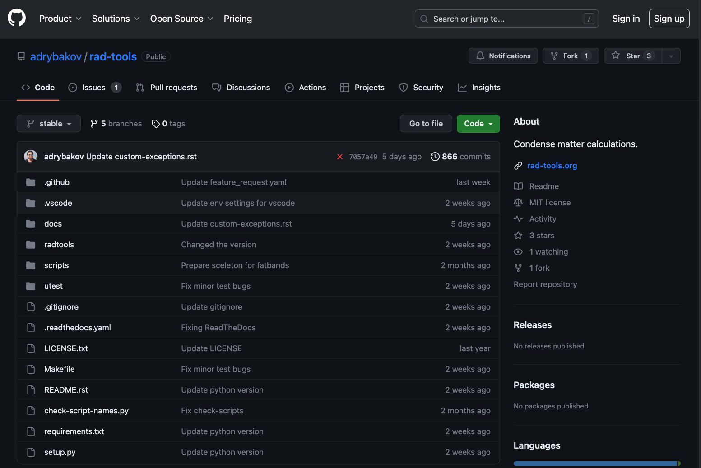
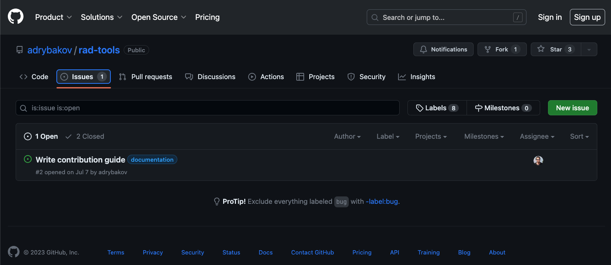
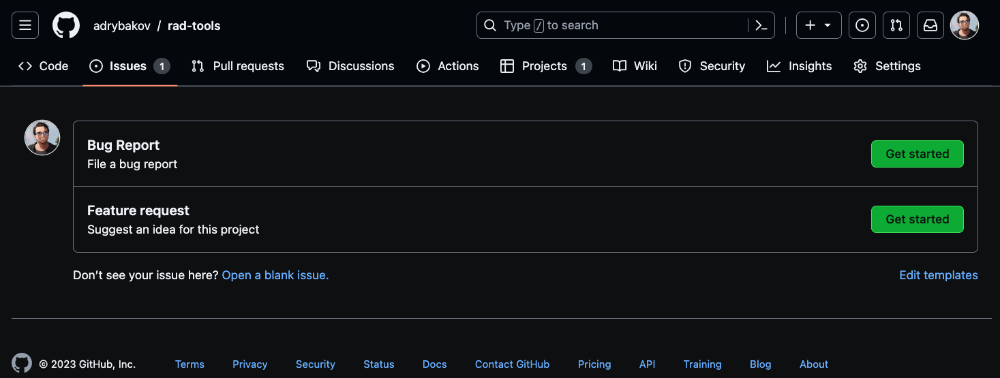
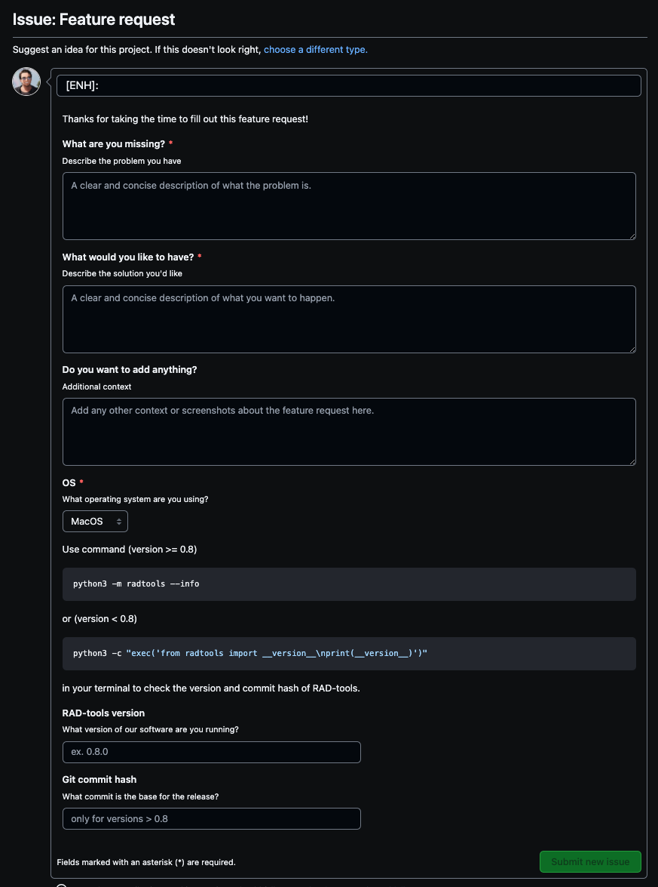

.. _contribute_feature:

***************
Feature request
***************

If you have an idea for the project. You can submit a feature request!

Feature requests are managed as issues on the github repository of the project.

In order to submit a feature request log in to your github account and go to the 
repository of the project: |RAD-repo|_

Then click on the "Issues" tab. 

Click on the "New issue" button:

You will see two prepared template for the issues. Click on the "Get started" for the
"Feature request" template:

Fill in the template and click on the "Submit new issue" button:

