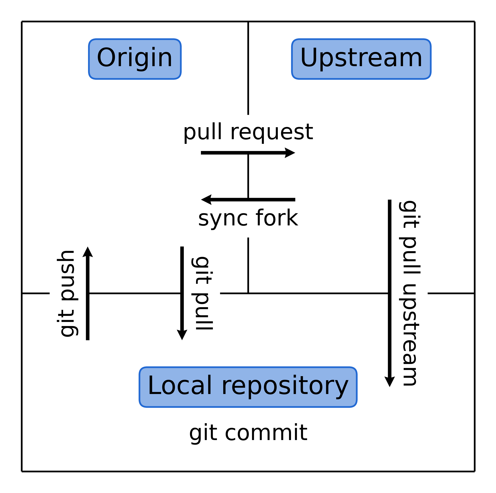

.. _contribute_origin-upstream:

*******************
Origin and Upstream
*******************

The collaboration model used in the development of RAD-tools is based on the
|Fork-and-pull|_ model. We use the standard terminology **Upstream** and **Origin** to
refer to the two |Git-remote|_ repositories that are used in the development process.
The picture below summaries the relationship between the two repositories and the local
repository with the most common communications between them:

.. _contribute_origin-upstream_origin:

Origin repository
=================

We refer to the RAD-tools repository under **your** personal account as the **Origin**
repository.

During the development process it is the repository that you will be pushing your
changes to. Once the feature you're working on is ready, you will create a pull request
from the **Origin** repository to the **Upstream** repository.

.. _contribute_origin-upstream_upstream:

Upstream repository
===================

We refer to the main |RAD-repo|_, from which the release is made, as the **Upstream**
repository.

You can pull changes from the **Upstream** repository to your local repository to keep
it up to date with the latest changes in the **Upstream** repository. Alternatively,
you can  *sync fork* from the github interface to keep your **Origin** repository up to
date with the **Upstream** repository.

.. _contribute_origin-upstream_local:

Local repository
================

The local repository is the repository on your computer where you will be making
changes to the code and committing them. Typically, you will be pushing your changes to
the **Origin** repository and pulling changes of other people from the **Upstream**
repository.
