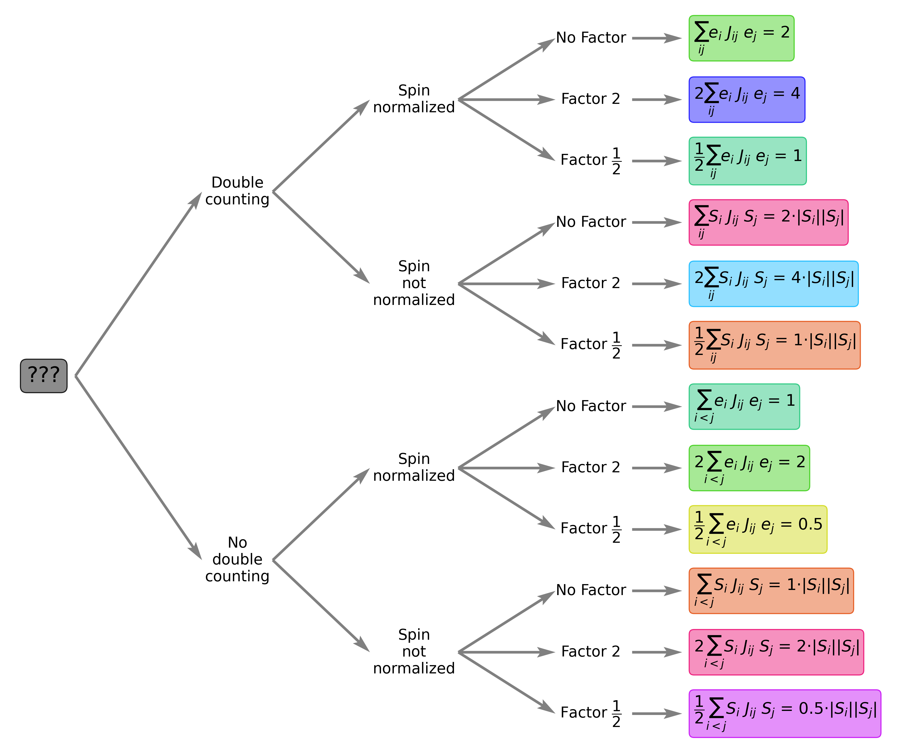

.. _library_spinham_notation:

****************************
Notation of spin Hamiltonian
****************************

The notation, which is considered to be the standard for the RAD-tools:

.. math::

    H = -\sum_{i,j} \hat{\boldsymbol{S}}_i \cdot \boldsymbol{J}_{i,j} \hat{\boldsymbol{S}}_j

It has double-counting, spins are not normalized, and the exchange parameter is
positive for ferromagnetic order.

.. note::
    The "standard" here does not mean that the :py:class:`.SpinHamiltonian`
    always has this notation. For example when :py:class:`.SpinHamiltonian` is
    read from |TB2J|_ file (:py:func:`.load_tb2j_model`) it has the notation of TB2J.

Notation of the spin Hamiltonian is defined with two properties and the numerical
factor before the sum. The properties are:

* :py:attr:`.double_counting`
    Whether both pairs :math:`(i, j)` and :math:`(j, i)` are included in the sum.

    If double counting is avoided it is usually indicated under the sum sign:

    .. math::

        \sum_{i < j} \text{ or } \sum_{i > j}

    When double counting is implied there are no indication under the sum sign:

    .. math::

        \sum_{ij}

    However, some authors are using

    .. math::

        \sum_{<ij>}

    as an indication of the avoided double counting, which we find confusing
    and discourage you to use it in this way. In textbooks this indication usually
    implies that only near-neighbors are included in the sum, which is not the same as
    avoided double counting (consecutively :math:`\sum_{<<ij>>}` is used to indicate
    next-nearest neighbors and so on).

    .. note::

        Indication

        .. math::

            \sum_{i \ne j}

        Does not mean that double counting is avoided.
        It rather say that no exchange of the atom with itself is present.

* :py:attr:`.spin_normalized`
    :math:`\boldsymbol{S}_i` in the spin Hamiltonian is viewed as a spin operator
    or as a classical spin vector. If it is normalised to :math:`1`,
    then exchange parameter absorbs the factor
    :math:`\vert\boldsymbol{S}_i\vert \vert\boldsymbol{S}_j\vert`.

Numerical :py:attr:`.factor` in general can be arbitrary, but in practice only three cases are met:

* Factor :math:`\dfrac{1}{2}`
    Factor :math:`1/2` is sometimes included in order to compensate for the double counting. If
    it is included, then it is simply written before the sum sign. It is usually used
    when double counting is present.
* Factor :math:`2`
    Factor :math:`2` is sometimes included in order to account for double counting. If
    it is included, then it is simply written before the sum sign. It is usually used
    when double counting is avoided.
* Minus sign
    Whether the minus sign is included in the Hamiltonian.

.. caution::

    We would like to note that not all authors are thoughtful with the definition
    of the Hamiltonian, therefore, additional care is required when reading the literature.

RAD-tools utilizes those properties in order to define the notation of the
spin Hamiltonian. During the creation of the :py:class:`.SpinHamiltonian` object the
notation is deliberately not defined, because it depends on your interpretation.
Therefore, the notation has to be defined explicitly by you. If the notation is not
defined, and you are trying to use the properties and methods that rely on it,
then the :py:exc:`.NotationError` is raised.
See :ref:`Examples <library_spinham_notation-examples>` for the usage.

Conversion of the notation
==========================

In the figure below we illustrate the problem of the notation's convention. The picture describes the
whole notation tree, if no minus sign is considered present (:py:attr:`.SpinHamiltonian.factor`
is positive). Click on the picture to enlarge it.

In the picture we assume that there are only two centers :math:`i` and :math:`j`, which are
connected by the exchange parameter :math:`\boldsymbol{J}_{i,j}` (as displayed in the left top corner).
The alignment of the spins is ferromagnetic. Then the numbers on the right side of the picture are the
energies of that system in the corresponding notation under the assumption that exchange parameter
is equal to :math:`1` in **each** notation.

These numbers provide a way for you to convert the exchange parameters from one notation
to another. The conversion is based on the following principle:

    Energy of the system should not depend on the choice of notation.

Note, that in the picture the systems are essentially
are different since the exchange parameters are equal to one in each notation and the energies are different.

The rule for the conversion from notation one (N1) to the notation two (N2) is the following:

* Follow the notation tree for each notation. Obtain factor one :math:`f_1` and factor two :math:`f_2`.

* If in the notation one (N1) minus sign is written (i.e. positive exchange parameter means ferromagnetic alignment), multiply the factor :math:`f_1` by :math:`-1`.

* If in the notation two (N2) minus sign is written (i.e. positive exchange parameter means ferromagnetic alignment), multiply the factor :math:`f_2` by :math:`-1`.

* compute conversion factor :math:`f` for the exchange parameters as

.. math::

    f = \dfrac{f_1}{f_2}

* Multiply exchange parameters in the notation one (N1) by the conversion factor :math:`f`.

The result are the exchange parameters in the notation two (N2):

.. math::

    J_{N2} = \dfrac{f_1}{f_2} J_{N1}

:py:class:`.SpinHamiltonian` does this automatically for you, when you are trying to
set the :py:attr:`.SpinHamiltonian.notation` property or individual properties of the notation:
:py:attr:`.SpinHamiltonian.double_counting`, :py:attr:`.SpinHamiltonian.spin_normalized`,
:py:attr:`.SpinHamiltonian.factor`. See :ref:`Examples <library_spinham_notation-examples>` for the usage.
Note that when you set the notation for the very first time the **interpretation** is set, therefore,
the parameters are not changed.

Predefined notations
====================

There are several predefined notations in the RAD-tools. Each predefined notation is a
tuple of two ``bool`` and one ``float``, which correspond to the three properties of the notation.

.. hint::
    Order: (double counting, spin normalized, factor).

* Standard
    (True, False, -1)

    .. math::
        H = -\sum_{i,j} \hat{\boldsymbol{S}}_i \cdot \boldsymbol{J}_{i,j} \cdot \hat{\boldsymbol{S}}_j

    where double counting is present (:math:`ij` and :math:`ji` are in the sum).
    Spin vectors are **not** normalized.
* |TB2J|_
    (True, True, -1)

    .. math::
        H = -\sum_{i,j} \hat{\boldsymbol{e}}_i \cdot \boldsymbol{J}_{i,j} \cdot \hat{\boldsymbol{e}}_j

    where double counting is present (:math:`ij` and :math:`ji` are in the sum).
    Spin vectors are normalized to 1.
* |Vampire|_
    (True, True, -1/2)

    .. math::
        H = - \dfrac{1}{2}\sum_{i<j} \hat{\boldsymbol{e}}_i \cdot \boldsymbol{J}_{i,j} \cdot \hat{\boldsymbol{e}}_j

    where double counting is present (only :math:`ij` is in the sum).
    Spin vectors are normalized.
* SpinW
    (True, False, 1)

    .. math::
        H = \sum_{i,j} \hat{\boldsymbol{S}}_i \cdot \boldsymbol{J}_{i,j} \cdot \hat{\boldsymbol{S}}_j

    where double counting is present (:math:`ij` and :math:`ji` are in the sum).
    Spin vectors are **not** normalized.

See :ref:`Examples <library_spinham_notation-examples>` for the usage.
