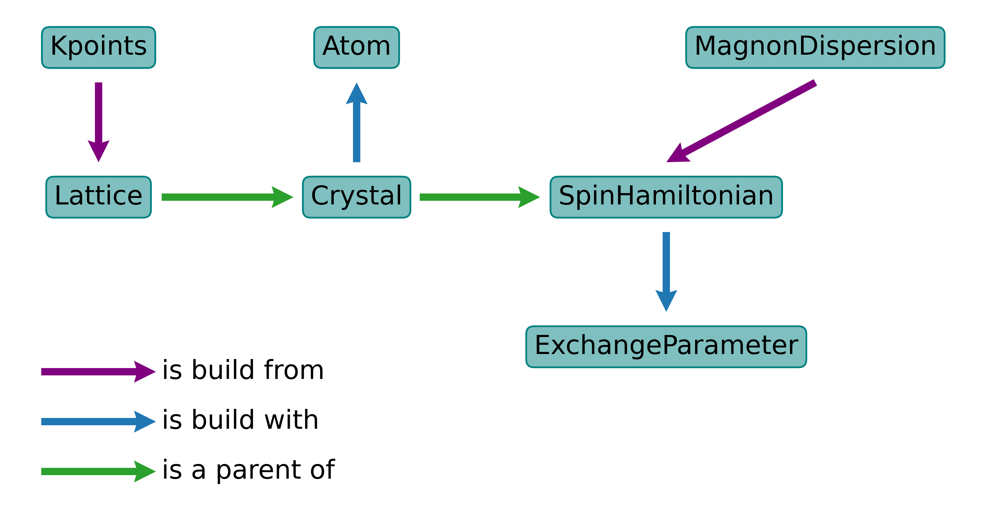

.. _module-guide:

************
Module guide
************

Module guide is directed at the users, who wants to use the package as python library. 
The main objective of the module guide is to
familiarise you with the package and provide examples of usage. 

If you want to use command-line interface check out the :ref:`scripts-guide`.

Data structure and import 
=========================

RAD-tools is a collection of submodules, which combine the classes and functions
with the same topic. For the full reference of the submodules, please refer to the
:ref:`api`.

All public methods of each submodule are exposed to the main entry 
point (``radtools``):

.. doctest::

    >>> from radtools import Crystal, print_2d_array, Cell, SpinHamiltonian

Explicit imports are supported as well:

.. doctest::

    >>> from radtools.crystal import Crystal, Cell
    >>> from radtools.decorate import print_2d_array
    >>> from radtools.spinham import SpinHamiltonian

As well as the exact imports:

.. doctest::
    
        >>> from radtools.crystal.crystal import Crystal
        >>> from radtools.crystal import cell as Cell
        >>> from radtools.decorate.array import print_2d_array
        >>> from radtools.spinham.hamiltonian import SpinHamiltonian

The first method is recommended for the user, as it is the most convenient 
and provides the most intuitive way of using the package. 

The third method is useful for the
advanced users, who wants to :ref:`contribute <rad-tools_contribute>` to the package.

In the examples of this guide, the first import method is used, unless stated otherwise.

Relation between classes
------------------------
Classes in RAD-tools illustrate a physical or mathematical
concept (i.e. :py:class:`.MagnonDispersion`, :py:class:`.Kpoints`, ...) 
or object (i.e. :py:class:`.Atom`, :py:class:`.Lattice`, :py:class:`.Crystal`, ...).
The relations between the classes could be roughly illustrated by the following diagram:

Submodules
==========

For the detailed guide on each submodule please refer to the corresponding page:

.. toctree::
    :maxdepth: 2
    
    spinham/index
    crystal/index
    routines
    io/index

    