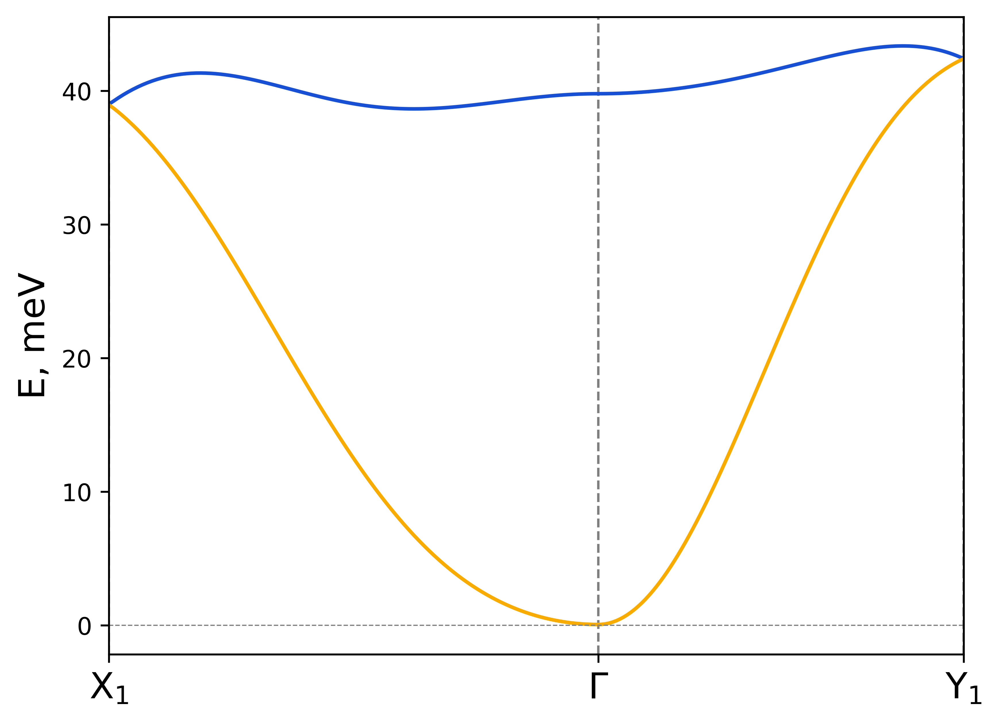
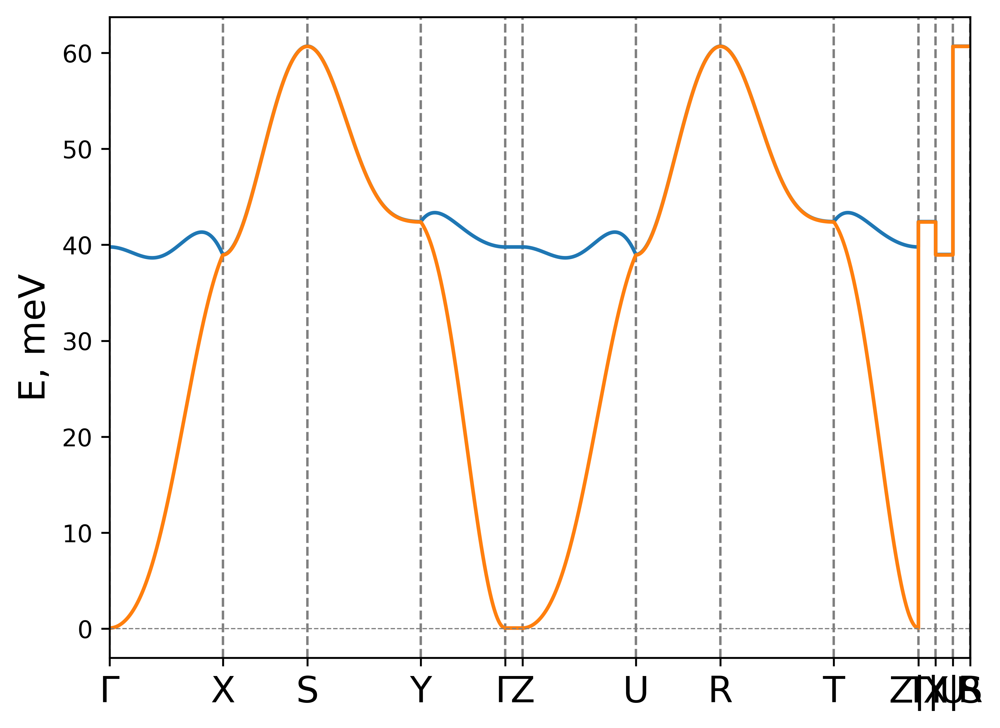
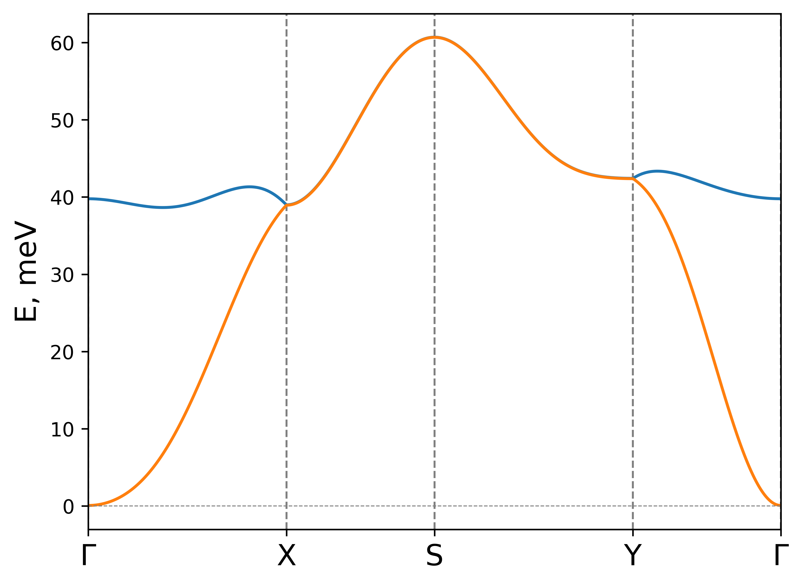

.. _rad-plot-tb2j-magnons:

*********************
rad-plot-tb2j-magnons
*********************

Script for plotting magnon dispersion from |TB2J|_ "exchange.out" file.

.. versionadded:: 0.7.12

.. versionchanged:: 0.9.0 Renamed from ``rad-plot-tb2j-magnons.py`` to ``rad-plot-tb2j-magnons``

Script plots magnon dispersion spectra following the algorithm described in
:ref:`library_magnon-dispersion-method`.

It requires |TB2J|_ output file "exchange.out" and
the information about the magnetic ground state.

Example is based on the files from
:examples:`examples folder <rad-plot-tb2j-magnons>`.

Ground state input
==================

Ground state is defined by two sets of parameters:

* Directions of spin in the unit cell (or supercell)
    To define direction of spins in the supercell use :ref:`rad-plot-tb2j-magnons_spin`
    parameter. You need to use the names of the atoms in the "exchange.out" file. Each name
    has to be followed by three numbers, separated by spaces. The numbers represent the x, y,
    and z components of the spin vector:

    .. code-block::

        -s Cr1 0 0 1.5 Cr2 0 0 1.5

* Spin-spiral vector. (single-Q incommensurate structure).
    Spin spiral is defined by two parameters, each parameter is a vector:

    * :math:`\boldsymbol{\vec{Q}}` (:ref:`rad-plot-tb2j-magnons_spiral-vector`)
        It is relative to the reciprocal cell.

    * Global rotation axis :math:`\boldsymbol{\vec{n}}` (:ref:`rad-plot-tb2j-magnons_rotation-axis`)
        It is given in absolute coordinate in a real space. Only the direction of the vector matters.

In the input file "exchange.out" six atoms are present: Br1, Cr1, S1, Br2, Cr2, S2.
Only Cr1 and Cr2 have exchange interaction between them. Therefore, it is necessary to specify
spin vectors for Cr1 and Cr2. You can specify spin vectors for all atoms, but it is not
necessary.

.. _rad-plot-tb2j-magnons_custom-k-points:

Custom k-points
===============

By default you can use predefined k-points based on the high symmetry points for each
:ref:`Bravais lattice <library_bravais-lattices>`. However, you can specify your own
high symmetry points using :ref:`rad-plot-tb2j-magnons_k-points` argument:

.. code-block:: bash

    rad-plot-tb2j-magnons -if exchange.out -kps X1 "$\mathrm{X_1}$" -0.5 0 0 Y1 "$\mathrm{Y_1}$" 0 -0.5 0 -kp X1-G-Y1 -s Cr1 0 0 1.5 Cr2 0 0 1.5 -on CrSBr-custom-kpoints

The syntax is the following:

.. code-block:: text

    -kps <name1> <label1> <kx1> <ky1> <kz1> <name2> <label2> <kx2> <ky2> <kz2> ...

where:

* <name> is the name of the k-point
    It can be used in the :ref:`rad-plot-tb2j-magnons_k-path` argument.

    .. note::

        If an error like:

        .. code-block:: text

            ValueError: Point 'X' already defined.

        appears, then you need to use different name for the k-points, because
        the name "X" is already used. Only the name is checked for uniqueness. Therefore,
        you can provide the same label for different k-points or custom label for one of the predefined
        k-points.
* <label> is the label of the k-point
    This string is directly passed to the plot. You can use |latex|_ syntax here.
* <kx> <ky> <kz> are the coordinates of the k-point relative to the reciprocal cell.

Template file
=============

Exchange template file (see :ref:`template-draft`) can be used to form the model or
to filter the spin Hamiltonian. Formation of the model means that the exchange parameters
from the |TB2J|_ are averaged over the individual bonds following the
:ref:`specification <template-draft>` of the template.

Filtering of the model
======================

For filtering the spin Hamiltonian there are a few options available:

* :ref:`--max_distance <rad-plot-tb2j-magnons_max-distance>`
* :ref:`--min_distance <rad-plot-tb2j-magnons_min-distance>`
* :ref:`--R-vector <rad-plot-tb2j-magnons_R-vector>`
* :ref:`--template <rad-plot-tb2j-magnons_template-file>`

Control of parameters
=====================

You can "turn off" parts of the full exchange matrix:

* :ref:`--nodmi <rad-plot-tb2j-magnons_nodmi>`
    Ignore :ref:`DMI <guide_spinham_parameter_dmi>` in the spinham.

* :ref:`-noa/--no-anisotropic <rad-plot-tb2j-magnons_no-anisotropic>`
    Ignore :ref:`anisotropic symmetric exchange <guide_spinham_parameter_aniso>` in the spinham.

Examples
========

CrSBr
-----

CrSBr is a ferromagnet with two magnetic sites in the unit cell. The minimum input is
the "exchange.out" file and the spin vectors for the two Cr atoms:

.. code-block:: bash

    rad-plot-tb2j-magnons -if exchange.out -s Cr1 0 0 1.5 Cr2 0 0 1.5 -on CrSBr

    Magnon dispersion for CrSBr.

Default k-path was detected based on the symmetry (:ref:`guide_orc`) of the lattice.

.. hint::

    Sometimes due to numerical inaccuracies detected symmetry of the lattice is not the one
    that you expect. In that case you may want to use :ref:`--bravais-type <rad-plot-tb2j-magnons_bravais-type>`
    argument. With this argument the script tries to reduce numerical accuracy to match the desired
    Bravais lattice type. If it fails, then check your lattice, maybe it is not the one you expect.

You can customise the k-path using :ref:`--k-path <rad-plot-tb2j-magnons_k-path>` argument
(see :ref:`guide_crystal_kpoints-path` for details):

.. code-block:: bash

    rad-plot-tb2j-magnons -if exchange.out -s Cr1 0 0 1.5 Cr2 0 0 1.5 -kp G-X-S-Y-G -on CrSBr-custom-path

    Magnon dispersion for CrSBr with custom path.

.. _rad-plot-tb2j-magnons_arguments:

Arguments
=========

.. _rad-plot-tb2j-magnons_input-filename:

-if, --input-filename
---------------------
Relative or absolute path to the "exchange.out" file, including the name and extension of the file itself.

.. code-block:: text

    required
    type: str

.. _rad-plot-tb2j-magnons_spin:

-s, --spin
----------
Spin of the atoms in the model.

For each atom, which has at least one bond connected to it is necessary to specify
spin vector. The spin vector is specified in the form of atom's name followed by
three numbers, separated by spaces.
The numbers represent the x, y, and z components of the spin vector.

.. code-block:: text

    required
    type: list of str

.. _rad-plot-tb2j-magnons_template-file:

-tf, --template-file
--------------------
Relative or absolute path to the template file, including the name and extension of the file.

.. code-block:: text

    optional
    type: str

.. _rad-plot-tb2j-magnons_output-name:

-on, --output-name
------------------
Seedname for the output files.

.. code-block:: text

    default: "magnon_dispersion"
    type: str

.. _rad-plot-tb2j-magnons_spiral-vector:

-Q, --spiral-vector
-------------------
Spin spiral vector. Relative to the reciprocal cell.

.. code-block:: text

    optional
    type: list of 3 float

.. _rad-plot-tb2j-magnons_rotation-axis:

-ra, --rotation-axis
--------------------
Direction of global rotation axis. In absolute coordinates in real space.

.. code-block:: text

    optional
    type: list of 3 float

.. _rad-plot-tb2j-magnons_k-points:

-kps, --k-points
----------------
Additional high-symmetry k-points.

Coordinates are relative to the reciprocal cell.

.. code-block:: text

    optional
    type: list of str

.. versionadded:: 0.8.9

.. _rad-plot-tb2j-magnons_k-path:

-kp, --k-path
-------------
Path in reciprocal space for the magnon dispersion.

.. code-block:: text

    optional
    type: str

.. _rad-plot-tb2j-magnons_form-model:

-fm, --form-model
-----------------
Whether to form the spinham based on the template.

.. code-block:: text

    default: False
    type: bool

.. _rad-plot-tb2j-magnons_R-vector:

-R, --R-vector
--------------
R vectors for filtering the spin Hamiltonian.

In TB2J outputs the bond is defined by atom 1 (from) and atom 2 (to).
Atom 1 is always located in (0, 0, 0) unit cell, while atom 2 is located in
R = (i, j, k) unit cell. This parameter tells the script to keep only the
bonds for which atom 2 is located in one of specified R supercells.
Supercells are specified by a set of integers separated by spaces.
They are grouped by three starting from the left and forms a set
of R vectors. If the last group contains 1 or 2 integers they are ignored.

.. code-block:: text

    optional
    type: list of int

.. _rad-plot-tb2j-magnons_max-distance:

-maxd, --max-distance
---------------------
(<=) Maximum distance.

All the bonds with the distance between atom 1 and atom 2
greater than maximum distance are excluded from the model.

.. code-block:: text

    optional
    type: float

.. versionadded:: 0.8.0

.. _rad-plot-tb2j-magnons_min-distance:

-mind, --min-distance
---------------------
(>=) Minimum distance.

All the bonds with the distance between atom 1 and atom 2
lower than minimum distance are excluded from the Hamiltonian.

.. code-block:: text

    optional
    type: float

.. versionadded:: 0.8.0

.. _rad-plot-tb2j-magnons_save-txt:

-st, --save-txt
---------------
Whether to save data to .txt file.

Two files appears: "output-name.txt" and "output-name_info.txt".
First one contains raw data of the graph,
second one contains information about the parameters.

.. code-block:: text

    default: False
    type: bool

.. _rad-plot-tb2j-magnons_interactive:

-i, --interactive
-----------------
Whether to show interactive plot.

.. code-block:: text

    default: False
    type: bool

.. _rad-plot-tb2j-magnons_verbose:

-v, --verbose
-------------
Verbose output, propagates to the called methods.

.. code-block:: text

    default: False
    type: bool

.. _rad-plot-tb2j-magnons_bravais-type:

-bt, --bravais-type
-------------------
Bravais lattice type. If not provided, the type is identified automatically.

It does not force the Bravais lattice type on the model,
but tries to reach the desired type by reducing the
numerical accuracy in the :py:func:`lepage` algorithm.

.. code-block:: text

    optional
    type: str

.. _rad-plot-tb2j-magnons_join-output:

-jo, --join-output
------------------
Whether to join the output files into a single file.

.. code-block:: text

    default: False
    type: bool

.. _rad-plot-tb2j-magnons_nodmi:

-nodmi
------
Whether to ignore DMI in the spinham.

.. code-block:: text

    default: False
    type: bool

.. _rad-plot-tb2j-magnons_no-anisotropic:

-noa, --no-anisotropic
----------------------
Whether to ignore anisotropic symmetric exchange in the spinham.

.. code-block:: text

    default: False
    type: bool
